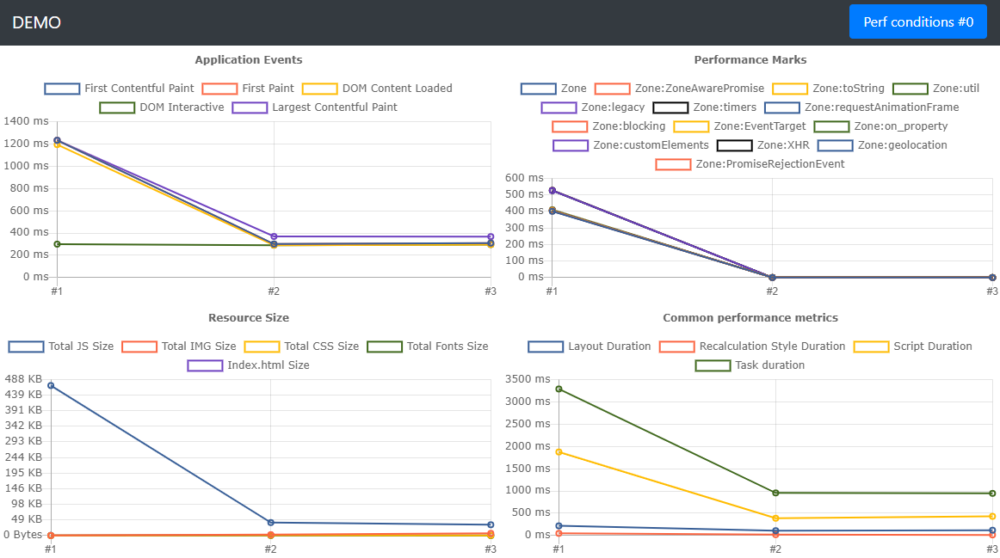

# Perfrunner

## Why

Helps you to track the performance your web application and compare different solutions.

## Performance data for Angular vs React vs Vue



## Features

* Simple UI to track performance changes
* Various output - html, json, csv
* Good precision with automated multiple reruns
* Saving all traces for further investigation
* Supports multiple network conditions - slow3g, fast3g, 4g
* Test your app with or without cache

## How to start

### Run the performance test

```cmd
npx perfrunner-cli https://drag13.io/
```

Change something and run it again to check the difference

### With the network setup

```cmd
npx perfrunner-cli https://drag13.io/ --network slow-3g
```

### With network and throttling

```cmd
npx perfrunner-cli https://drag13.io/ --network slow-3g -T 4
```

### With network, throttling, and cache

```cmd
npx perfrunner-cli https://drag13.io/ --network slow-3g -T 4 --cache
```

### Generate json instead of HTML

```
npx perfrunner-cli https://drag13.io/ --reporter toJson
```

For other commands check [perfrunner-cli](./packages/perfrunner-cli)

## Related packages

* [perfrunner-cli](./packages/perfrunner-cli) - command line interface for the perfrunner
* [perfrunner-core](./packages/perfrunner-core) - runs tests and aggregate result
* [perfrunner-reporters](./packages/perfrunner-reporters) - process result

## Credits

* [raharrison](https://github.com/raharrison) for inspiration and examples
